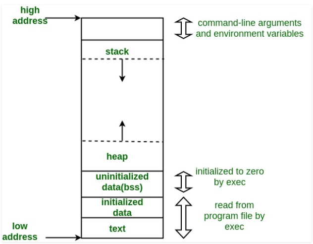
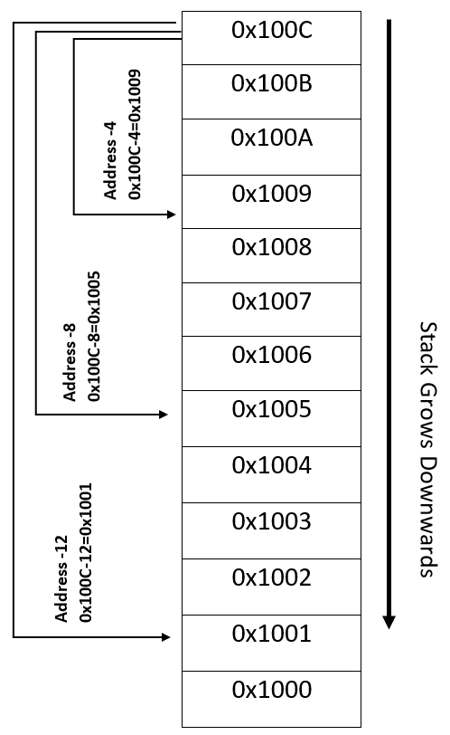
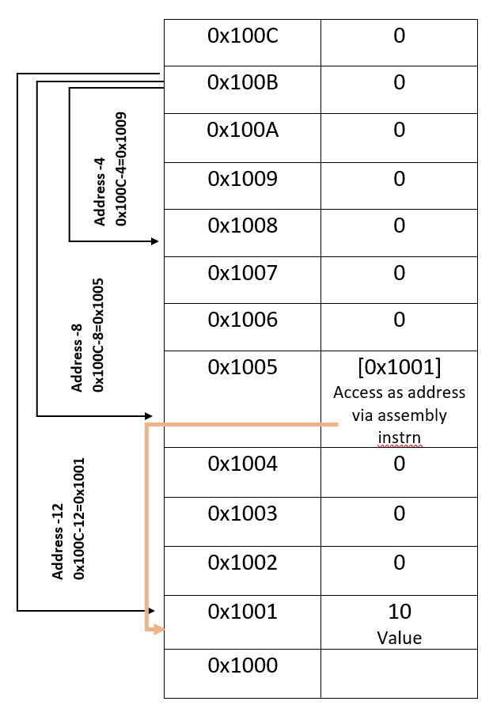

# Lvalue and Rvalue references

This section discusses about **lvalues** and **rvalues**, 

***what*** are *variables* and what are *references*

***what*** are *lvalues and rvalues*?

***what*** is the ***use*** of *lvalue and rvalue* concept?

***how*** can *lvalues and rvalues* be accessed?

***how*** are *lvalues and rvalues* ***stored*** in memory?

***how*** can *lvalues and rvalues* be ***accessed***?


## Part-I

##### *Variables, Memory, References and Lvalues*

Usually we have a misconception about lvalue being left hand side value and rvalue being right hand side value. This it true to some extent, but this is not all.

We can understand that lvalues are values that are stored in memory, where as rvalues are values that are not stored in memory. 

Confusing !!! 

Let's work it out.

You can skip this section if you are already familiar with memory layout and jump to [next](https://github.com/TechTotie/cpp/tree/master/lvalue_rvalue#variables-references-and-their-relationship-with-memory)


#### *Memory Layout*

Before proceeding further, let us have a ***quick glance*** over how [memory is arranged](https://www.geeksforgeeks.org/memory-layout-of-c-program/), basically [memory layout](https://www.geeksforgeeks.org/memory-layout-of-c-program/).



A typical memory layout of a running process

**1. Text Segment:**
A text segment , also known as a code segment or simply as text, is one of the sections of a program in an object file or in memory, which contains executable instructions.

**2. Initialized Data Segment:**
Initialized data segment, usually called simply the Data Segment. A data segment is a portion of virtual address space of a program, which contains the global variables and static variables that are initialized by the programmer.

Ex: static int i = 10 will be stored in data segment and global int i = 10 will also be stored in data segment

**3. Uninitialized Data Segment:**
Uninitialized data segment, often called the “bss” segment, named after an ancient assembler operator that stood for “block started by symbol.” Data in this segment is initialized by the kernel to arithmetic 0 before the program starts executing

uninitialized data starts at the end of the data segment and contains all global variables and static variables that are initialized to zero or do not have explicit initialization in source code.

**4. Stack:**
The stack area traditionally adjoined the heap area and grew the opposite direction; when the stack pointer met the heap pointer, free memory was exhausted. The stack area contains the program stack, a LIFO structure, typically located in the higher parts of memory.

A “stack pointer” register tracks the top of the stack; it is adjusted each time a value is “pushed” onto the stack. The set of values pushed for one function call is termed a “stack frame”; A stack frame consists at minimum of a return address. Stack is the memory, where automatic variables are stored, 

**5. Heap:**
Heap is the segment where dynamic memory allocation usually takes place.

The heap area begins at the end of the BSS segment and grows to larger addresses from there.The Heap area is managed by malloc, realloc, and free, which may use the brk and sbrk system calls to adjust its size.

The Heap area is shared by all shared libraries and dynamically loaded modules in a process.


## Variables, References and their relationship with memory

Now, lets see how a **c++ code** works with ***respect to memory*** and what actually ***references*** are and how are they accessed and ***operate in memory***.

Let us take a simple example to demonstrate this.

```c++
int main() {

 int x = 10;

}
```

In the above example,  we declare and define an integer variable x and assign it value of 10.

Let us see the *assembly (asm)* code for this.

```asm
main:
        push    rbp
        mov     rbp, rsp
        mov     DWORD PTR [rbp-4], 10
        mov     eax, 0
        pop     rbp
        ret
```

Form the memory layout, we know that ***stack grows downwards***. For instance, let us consider a stack block with starting address of 0x000C (C is 12 in hex).  So, if register rbp ([***rbp***](https://wiki.cdot.senecacollege.ca/wiki/X86_64_Register_and_Instruction_Quick_Start) special register that stores the ***base pointer***) contains the value **0x100C**, `[rbp-4]` will be `[0x100C-4]`, i.e., **0x1009**, `[rbp-8]` will be `[0x100C-8]`, i.e., **0x1005**, and `[rbp-12]` will be `[0x100C-12]`, i.e.,  **0x1001** as shown in the below figure.



Let us assume the following ***initial*** contents of the registers to explain this example better.

| Register | rbp    | rsp    | rbp-4 *(points to/contains address 0x1009)* | 0x1009     | eax    |
| -------- | ------ | ------ | ------------------------------------------- | ---------- | ------ |
| Contents | 0x100C | 0x200C | NA                                          | Junk value | 0x0000 |

Let us parse the assembly instructions manually. This sections describes the assembly code along with what each instruction does with links to those instructions.

The first line ``` push rbp ``` (***rbp*** special register that stores the ***base pointer*** ) [**pushes**](https://www.aldeid.com/wiki/X86-assembly/Instructions/push) the return address into stack, so that the [***program counter***](https://en.wikipedia.org/wiki/Program_counter) (***pc***) gets the return address as soon as it returns from this program.

The second line with the [mov](https://www.aldeid.com/wiki/X86-assembly/Instructions/mov) instruction```mov rbp, rsp``` moves the content of [***stack pointer***](https://en.wikipedia.org/wiki/Stack_register) (***rsp***) into ***rbp***, and the program further uses this as base pointer for further memory accesses. 

Now the contents of the registers will be changed as

| Register | rbp    | rsp    | rbp-4 *(points to/contains address 0x1004)* | 0x1004     | eax                |
| -------- | ------ | ------ | ------------------------------------------- | ---------- | ------------------ |
| Content  | 0x2000 | 0x2000 | NA                                          | Junk value | Any previous value |

These 2 lines correspond to the C++ code `int main() {`

The ***next*** line `int x =10` corresponds to the assembly instruction```mov DWORD PTR [rbp-4], 10```  which has instruction to push the value 10 into ***memory address pointed by*** ```rpb-4```, i.e., memory location `[0x1009]` which is achieved by assembly instruction ```DWORD PTR [rbp-4]``` , a stack address that occupies `4 bytes` of memory. `DWORD PTR` is assembly instruction or an assembly size directive [Assembly Size Directive](http://www.cs.virginia.edu/~evans/cs216/guides/x86.html ) or an instruction, that directs the computer to treat the contents os `rbp-4` as memory address which has capability of storing 32 bits, i.e., 4 bytes, which is sizeof int. 

Now the contents of the registers and memory will be changed as

| Register | rbp    | rsp    | rbp-4 *(points to/contains address 0x1009)* | 0x1009 | eax                |
| -------- | ------ | ------ | ------------------------------------------- | ------ | ------------------ |
| Content  | 0x200C | 0x200C | points to/contains address 0x1009           | 10     | Any previous value |

The memory is nothing but stack memory as `x` is a local variable in `main` function.

The last three lines are again book keeping operations, which corresponds to the closing brace  `}`  of the C++ program.

The instruction `mov eax, 0` assigns the value 0 to the register eax,  and the instruction `pop rbp`  helps restore the contents of base pointer by pop operation and then followed by return statement `ret`.

Now in the above assembly we see that there is an access to memory location using the rbp pointer contents, that uses 4 bytes and stores value 10 in it. ***This memory location is nothing but the value x that we access in our program.***

To make it clear, let us add another statement in our C++ program.

```c++
int main() {
 int x = 10;
 x = 20;
}
```

`x = 20`is the extra line that is added.

Now, let us see the *assembly code* 

```assembly
main:
        push    rbp
        mov     rbp, rsp
        mov     DWORD PTR [rbp-4], 10
        mov     DWORD PTR [rbp-4], 20
        mov     eax, 0
        pop     rbp
        ret
```

Can you notice the extra line `mov DWORD PTR [rbp-4], 20` as compared to the previous assembly code, which corresponds to the code `x = 20;`.

Here the variable x is referred by the memory address given by `DWORD PTR [rbp-4]`and value `20` is moved into or assigned to it.

So, wherever we access variable `x` we access the memory pointed by `DWORD PTR [rbp-4]`.

Printing the address using `&x` gives the actual memory address, which in our example case will be `[0x1009]`(Address for demonstration only not actual one).

***So, variable `x` that occupies memory and has a valid memory location is called lvalue.***

Now let us look at another program

```c++
int main() {
    int x = 10;
    int & xref = x;
}
```

In the above program, there is a reference `int & xref` created for variable `x`.

Let us look at the assembly code.

```assembly
main:
        push    rbp
        mov     rbp, rsp
        mov     DWORD PTR [rbp-12], 10
        lea     rax, [rbp-12]
        mov     QWORD PTR [rbp-8], rax
        mov     eax, 0
        pop     rbp
        ret
```

Let us assume the following ***initial*** contents of the registers to explain this example better.

| Register | rbp    | rsp    | rbp-12 *(points to address 0x1001)* | 0x1001     | rbp-8 ***(points to address 0x1005)*** | 0x1009     | eax    |
| -------- | ------ | ------ | ----------------------------------- | ---------- | -------------------------------------- | ---------- | ------ |
| Content  | 0x100C | 0x200C | some value                          | Junk value | some address                           | Junk value | 0x0000 |

When compared to the previous example, the statement `int & xref = x;` has introduced 2 more assembly instructions `lea rax, [rbp-12]` and `mov QWORD PTR [rbp-8], rax`.  

The instruction `lea rax, [rbp-12]` [loads the effective address](https://stackoverflow.com/questions/1658294/whats-the-purpose-of-the-lea-instruction) ([LEA](https://c9x.me/x86/html/file_module_x86_id_153.html)) stored of [rbp register -12] , i.e., loads `[0x1001]` (which is address of `x`) into accumulator ([accumulator](https://en.wikipedia.org/wiki/Accumulator_(computing)) is a special [register](https://www.coursehero.com/file/p43p94l/RAX-Accumulator-is-used-as-a-dedicated-register-by-some-arithmetic-operation/)).

Then the instruction `mov QWORD PTR [rbp-8], rax` copies the content of the accumulator register i.e., address `[0x1001]` into memory location pointed by register `rbp-8`,i.e., `[0x1005]` and `QWORD PTR` indicates that this content **should be treated** **as an address** that can store `8 bytes`(size of a quad word).

 Now the memory locations will be as shown below



From the above figure you can notice that the contents of memory location **`[0x1005]`** is accessed as an address via assembly instruction using *QWORD PTR*

Now the contents of the registers will be changed as

| Register | rbp    | rsp  | rbp-12 *(points to address 0x1001)* | 0x1001 | rbp-8 ***(points to address 0x1005)*** | 0x1005         | eax    |
| -------- | ------ | ---- | ----------------------------------- | ------ | -------------------------------------- | -------------- | ------ |
| Content  | 0x100C | C    | points to address 0x1001            | 10     | address 0x1001                         | address 0x1001 | 0x0000 |

So essentially creating a reference is just copying the mere address from on memory location to another, and wherever we use the reference the compiler generates code to access the copied address contents.

Now, if we add the line 

```c++
 xref = 20;
```

in our above code, it will add the following assembly instructions

```assembly
        mov     rax, QWORD PTR [rbp-8]
        mov     DWORD PTR [rax], 20
```

which shows that the operations are done on the same memory address that is stored in multiple places.

Now the contents of the registers will be changed as

| Register | rbp    | rsp    | rbp-12 *(points to address 0x1001)* | 0x1001 | rbp-8 ***(points to address 0x1005)*** | 0x1005         | eax    |
| -------- | ------ | ------ | ----------------------------------- | ------ | -------------------------------------- | -------------- | ------ |
| Content  | 0x100C | 0x200C | points to address 0x1001            | 20     | address 0x1001                         | address 0x1001 | 0x0000 |

Initally on creating the variable `x` the memory location of x was stored in `DWORD PTR [rbp-12]` and on creating a reference, a copy of the same address is created in `QWORD PTR [rbp-8]`.

One major point to be noted here is that wherever references are used, the compiler generates code to insert the instructions that will simply replace the reference variable (xref, in this case) with the address of the actual variable (x, in this case).

So, this is all about references and lvalues and references to lvalues.

**Conclusion**: ***Lvalues*** are stored in memory and have a valid memory address.


## Part -II

Now, let us modify our example code

```c++
int main() {
    int &n = 10;
}
```

<span style="color:red">This is a wrong code, it does not compile.</span>

This is because the code is trying to store value 10 into a reference. 

Now, let us dig it down.

From the previous section, we have understood that creating a reference basically creates code to copy memory address of a varaible ( remember/recall the instructions `lea  rax, [rbp-12]` and `mov  QWORD PTR [rbp-8], rax` that copies the memory address ). 

But in this example there is no memory allocated so there is no memory and you cannot copy the address of a memory that does not exist.

For the same reason, you cannot create a reference (***non-const***) to a constant value. (10 is a constant value).

Now, let us modify the above code to 

```c++
int main() {
    const int &n = 10;
}
```

Now the code compiles 

To be continued...